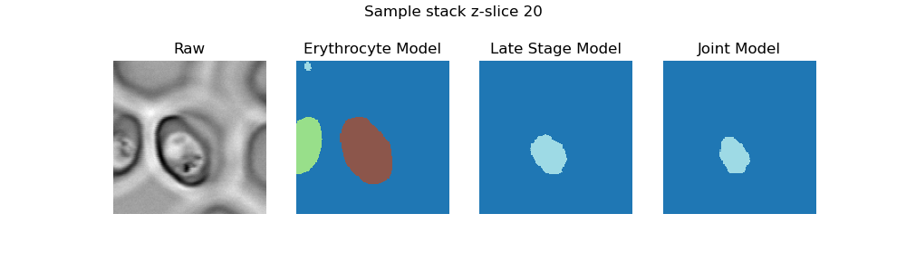
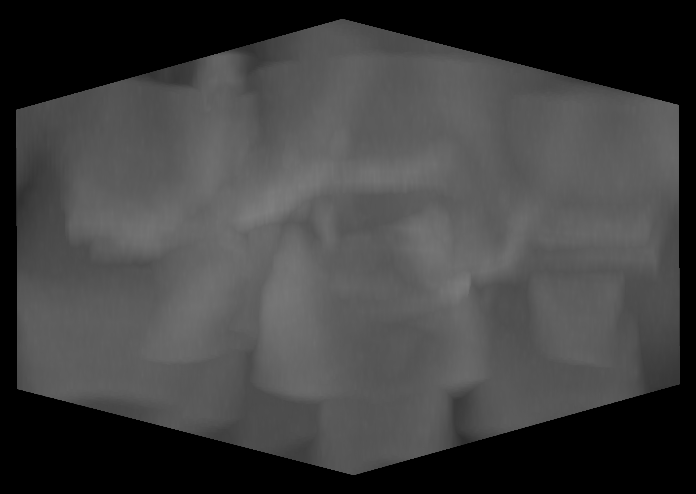
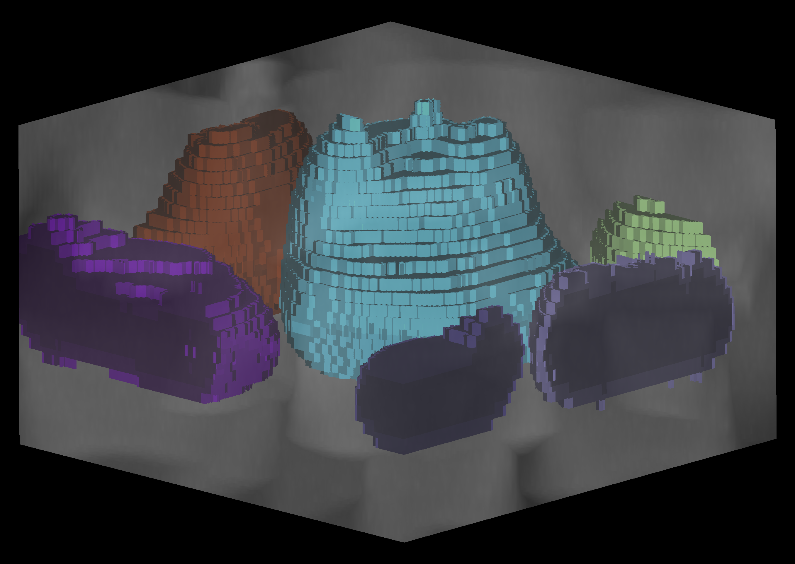
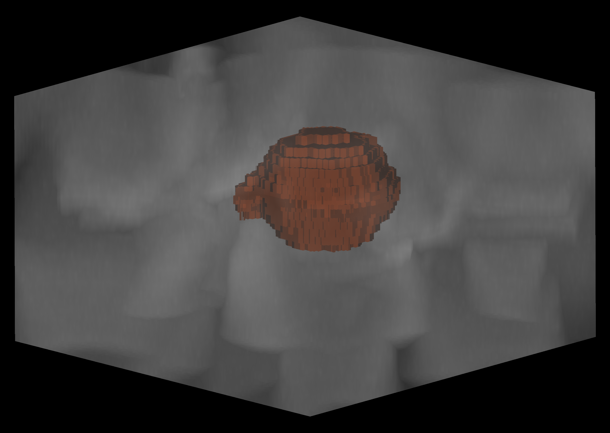

# RBC and parasite segmentation
This repo contains code for segmenting RBCs and malaria parasites in confocal 3D
image stacks and accomparnies the paper "Deep learning image analysis for continuous single-cell imaging of dynamic
processes in Plasmodium falciparum-infected erythrocytes".

The main workhorse is [cellpose](https://www.cellpose.org/), which is fine-tuned to specifically segment RBCs and parasites.


# Installation
TODO add setup.py and change code accordingly
1. Install [miniconda](https://docs.conda.io/en/latest/miniconda.html).
2. Install the dependencies:
```
conda env create -f environment.yml
```
3. Activate the environment
```
conda activate kahrp
```

# Overview

## Trained models
We provide two trained models in the `models` directory. The model `rbc[...]` was trained to segment RBCs, the model 
`parasite_late[...]` is trained to segment late-stage parasites, and the model `parasite_joint[...]` was jointly trained
on ring- and late-stage parasites. To try out these models on the sample image,
run
```
python run_cellpose.py
```
The three results will be saved in `data/sample_data/sample_stack/results`, a `.png` showing the segmentation masks for 
one z-slice will be saved in `data/figures`, and a `.tiff` image containing all the full segmentation stacks will be saved
there to. To inspect it, run

```
python run_napari.py
```
and click the `Split Channels` botton.




<p align="center">
  
  
  
  
</p>

## Directories
The file `path` contains a path to the location of the data. By default, it is set
to the data directory in the repo, but can be changed. All data, results, trained 
models and figures will be saved there.

Place your data into the data directory following the convention 
`data_dir/major_dataset/subsets`, where `subsets` are datasets that might be used 
jointly for training. Models trained on subsets of `major_dataset` will be saved in 
`data_dir/major_dataset/models`. Each `subset` should contain a subdirectory `data`,
where the actualy data lies, and one subdirectory `results`, where predictions and metrics
for this subset will be saved.

## Scripts
For the main functionality, set the parameters in `full_pipeline.py` and `post_process.py`. Then run both scripts. This
will train the models on the specified data, segment the data, perform cross-validation, and finally post-process the 
results. The post-processed results will be saved as `.tif` images in the `results` directory of the subset.

```
python full_pipeline.py
python post_process.py
```

The scripts can also be run separately, to only execute parts of the pipeline. Set the parameters in the respective main 
functions. For instance, to segment the sample image with the full models provided in the repo, run

```
python run_cellpose.py
```
The resulting segmentations will be saved in `data/sample_data/sample_stack/results`.

Description of the lower-level scripts:  
`train_cellpose.py`: Code for fine-tuning cellpose  
`run_cellpose.py`: Use a trained cellpose model to segment data  
`evaluate.py`: Compute metrics for segmented data  
`full_pipeline.py`: Pipeline combining the three above

`post_process.py`: Postprocess segmented data and save as `.tif` images

`run_napari.py`: Starts a custom version of napari that can split `.tif` channels.  
`utils.py`: Utilities.


## Notebooks
These notebooks are used to create the quantitative evaluation panels in Figure 3  
`eval_volume`: Depicts metrics of the RBC model on the full volume RBCs before post-processing  
`eval_membrane`: Depicts metrics of the RBC model on shells. Also, finds good parameters for 
the shells  
`eval_parasites`: Depicts metrics of the parasite model before post-processing  

These notebooks provide utilities  
`save_predictions`: Saves segmented images without post-processing
`post_prosessing`: Computes metrics after postprocessing and finds good parameters for both RBCs 
and parasites (not all are used as default as the "wholelifecycle" data had different issues than the
train data.)
